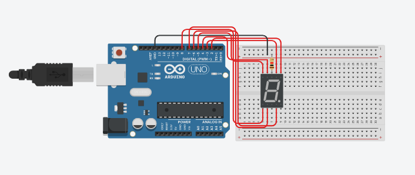

# Desafio 1 (**Arduino Uno**)
### Curso de Extensão (IFAL/Maceió - 2021): Computação Embarcada com Arduino Uno e ESP8266.


**Componentes**:
| Nome | Quantidade | Componente |
| ---- | ---------- | ---------- |
| U1   | 1          | Arduino Uno R3 |
| Digit1 | 1        | Catódica Visor de 7 segmentos |
| R1   | 1          | 1 kΩ Resistor |

- **Como Funciona?**
    Cada parte do visor de 7 segmentos tem uma letra de **A** à **G**. O objetivo é mostrar os números
naturais em ordem crescente do 0 até 9.
    Cada parte dos números tem seu conjunto de letras do visor.

    ```cpp
    0 -> A, B, C, D, E, F.
    1 -> B, C.
    2 -> A, B, G, E, D.
    3 -> A, B, G, C, D.
    4 -> B, G, F, C.
    5 -> A, F, G, C, D.
    6 -> A, F, G, C, D, E.
    7 -> A, B, C.
    8 -> A, B, C, D, E, F, G.
    9 -> A, B, C, D, F, G.
    ``` 
    O código funciona chamando cada parte dos números em uma função **void** com parâmetro de entrada *int* **numberation(int number)**, em um **for(int i = 0; i <= 9; i++)**.
    ```cpp
    void numeration(int number)
    {
        if(number == 0)
        {
            ...
        } 
        if(number == 9)
        {
            digitalWrite(E, LOW);
            delay(600);
            //limpeza de todas partes do visor.
            digitalWrite(A, LOW);
            digitalWrite(B, LOW);
            digitalWrite(C, LOW);
            digitalWrite(D, LOW);
            digitalWrite(E, LOW);
            digitalWrite(F, LOW);
            digitalWrite(G, LOW);
        }
    }
    ```